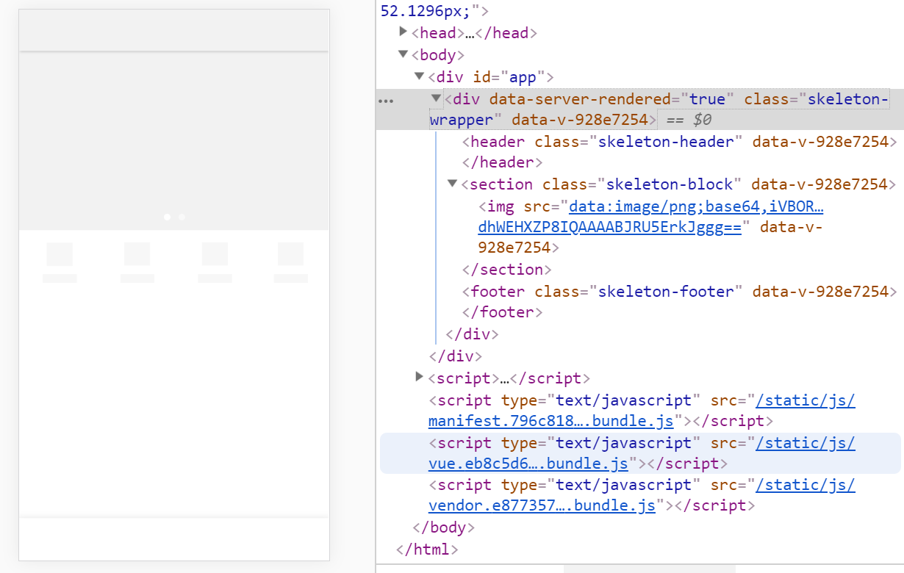

### 重构加载状态
+ 新增MiSkeleton.vue

+ 用[vuex](https://vuex.vuejs.org/zh/guide/)管理数据加载loading和过渡transitionName
+ 使用辅助函数:mapState、mapMutations
+ TheFooter.vue组件的处理

### 页面结构、数据结构、API接口分析
+ 页面结构：是否登录、商品列表、猜你喜欢
+ 数据结构
+ API接口：列表、增加商品、删除商品、选购服务、修改数量、选购服务

### 数据结构修改和渲染
+ 部分业务放前端处理
+ 服务和赠品和商品的关系

